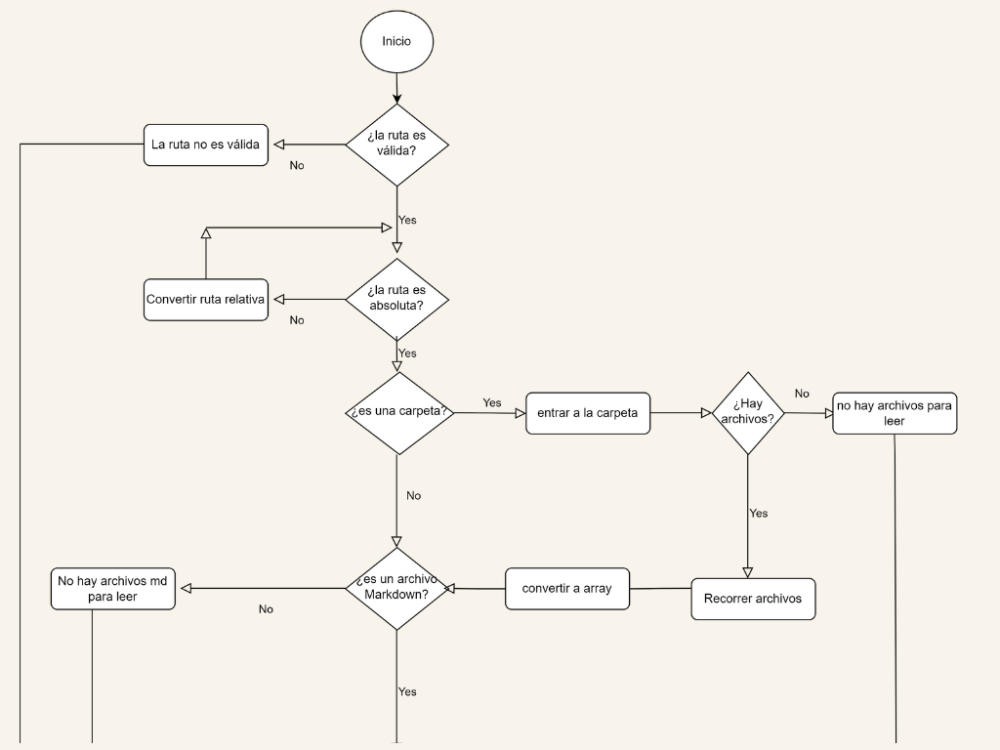
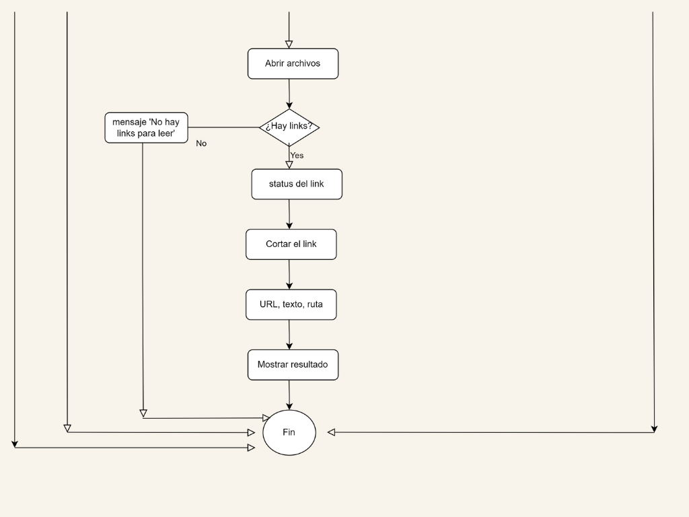
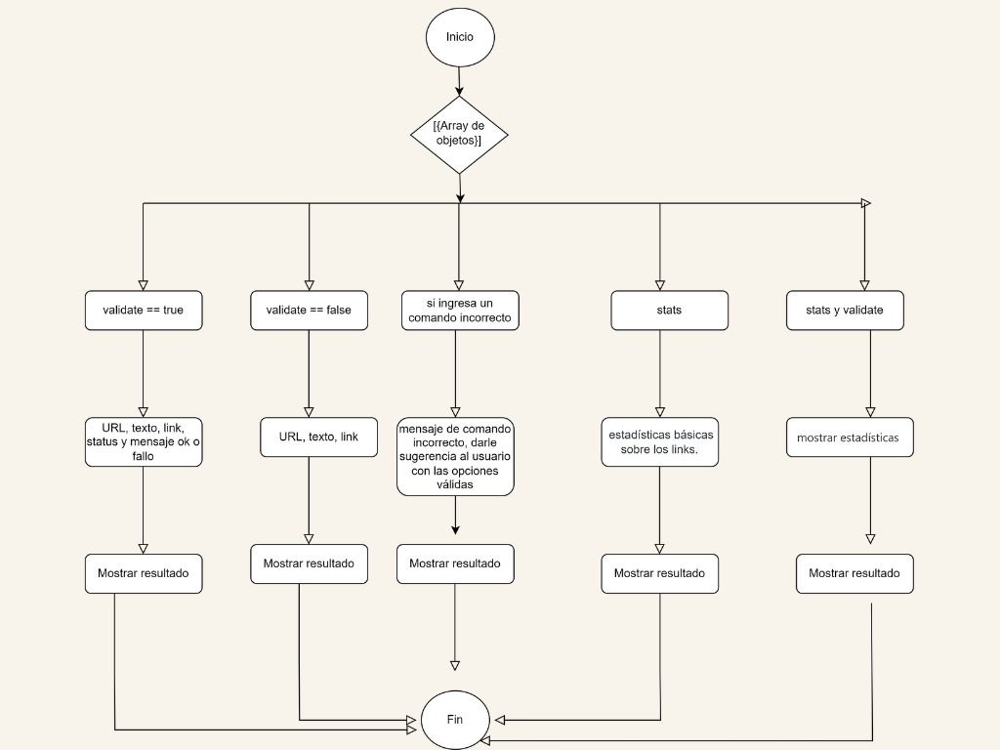
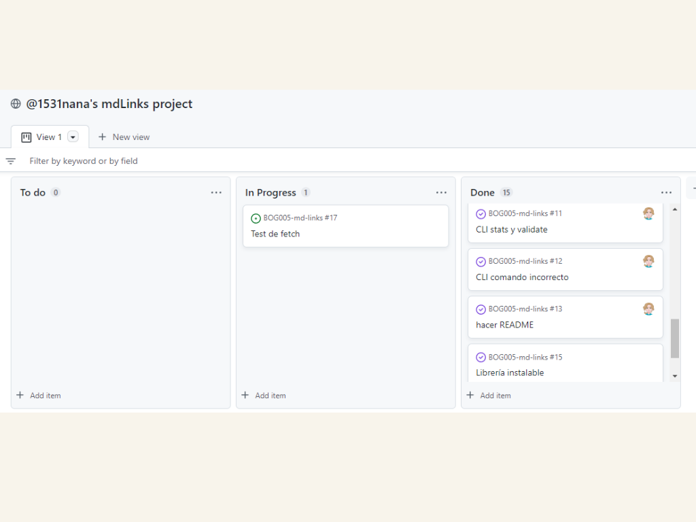

# Markdown Links

## 1. Preámbulo

[Markdown](https://es.wikipedia.org/wiki/Markdown) es un lenguaje de marcado
ligero muy popular entre developers. Es usado en muchísimas plataformas que
manejan texto plano (GitHub, foros, blogs, ...) y es muy común
encontrar varios archivos en ese formato en cualquier tipo de repositorio
(empezando por el tradicional `README.md`).

Estos archivos `Markdown` normalmente contienen _links_ (vínculos/ligas) que
muchas veces están rotos o ya no son válidos y eso perjudica mucho el valor de
la información que se quiere compartir.


## 2. Diagrama de flujo de la ruta



## 2.1 Diagrama de flujo del CLI


## 3. Plan de acción
Este plan de acción estuvo enfocado en minimizar los problemas planteados, con estimaciones de tiempo para mayor eficacia. Y fue elaborada en el projects de GitHub, permitiendo una sincronización de la planificación con el proyecto sobre el cual estaba trabajando.


## 1. Consideraciones técnicas
Esta librería recibe una ruta absoluta o relativa con archivos markdown, para así extraer los links y verificar si están rotos o no. También muestra una estadística respecto a todos los links encontrados, como la cantidad total , los que están rotos y los únicos(links que no se repiten en el/los archivo/s). 

El valor de entrada es una ruta absoluta "C:\Users\1531n\BOG005-md-links\README.md" o relativa "./some/example.md" 

## 2. Instalación 
```sh
npm install luzadri-md-links
```

### 1) JavaScript API

El módulo se puede **importar** en otros scripts de Node.js:

```js
const {mdLinks} = require("luzadri-md-links");

mdLinks("./some/example.md")
  .then(links => {
    // => [{ href, text, file }, ...]
  })
  .catch(console.error);

mdLinks("./some/example.md", { validate: true })
  .then(links => {
    // => [{ href, text, file, status, ok }, ...]
  })
  .catch(console.error);

mdLinks("./some/dir")
  .then(links => {
    // => [{ href, text, file }, ...]
  })
  .catch(console.error);
```

### 2) CLI (Command Line Interface - Interfaz de Línea de Comando)

En la **terminal** puede ejecutar las siguientes Lineas de Comando, de acuerdo a la información que requiera sobre su archivo markdown

`md-links <path-to-file> [options]`

Por ejemplo:

Si solo pasamos la ruta, muestra la ruta absoluta, el link y el texto

```sh
$ md-links ./some/example.md
./some/example.md http://algo.com/2/3/ Link a algo
./some/example.md https://otra-cosa.net/algun-doc.html algún doc
./some/example.md http://google.com/ Google
```

#### Options

##### `--validate`

Si pasamos la opción `--validate`,  muestra de cada link la ruta absoluta, el link, el código de status, si el link está roto('Fail') o está bien('OK') y el texto.

Por ejemplo:

```sh
$ md-links ./some/example.md --validate
./some/example.md http://algo.com/2/3/ ok 200 Link a algo
./some/example.md https://otra-cosa.net/algun-doc.html fail 404 algún doc
./some/example.md http://google.com/ ok 301 Google
```

##### `--stats`

Si pasamos la opción `--stats` será una estadística con los links totales y únicos

```sh
$ md-links ./some/example.md --stats
Total: 3
Unique: 3
```

También podemos combinar `--stats` y `--validate` para obtener estadísticas que
necesiten de los resultados de la validación.

```sh
$ md-links ./some/example.md --stats --validate
Total: 3
Unique: 3
Broken: 1
```

